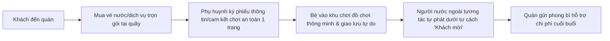

# BÁO CÁO RÀ SOÁT PHÁP LÝ TIN GỌN & TỐI ƯU HÓA VẬN HÀNH
## Mô hình: Quán Cà Phê Kết Hợp Không Gian Vui Chơi & Giao Lưu Người Nước Ngoài Tự Phát

---

## Mở đầu

Dựa trên phản hồi thực tế của bạn, báo cáo này đã được tinh giản tối đa nhằm cung cấp một **hành lang pháp lý gọn nhẹ, dễ triển khai, thủ tục giấy phép tối thiểu**, nhưng vẫn đảm bảo sự chặt chẽ, phòng ngừa rủi ro phạt hành chính hay đình chỉ hoạt động.

Báo cáo bám sát thực tế vận hành:
1. **Thu phí tin gọn**: Dưới hình thức bán vé nước uống/dịch vụ trọn gói (không thu học phí).
2. **Hoạt động tự phát**: Giao lưu tự phát hàng ngày, không giáo trình, quảng bá linh hoạt trên fanpage.
3. **Nhân sự nước ngoài**: Đối tác ngắn hạn không hợp đồng, chi thù lao dạng "phong bì cảm ơn" mỗi buổi.
4. **Đồ chơi thông minh**: Mua hàng second-hand (2nd) để tối ưu hóa chi phí.

---

## PHẦN I: Giấy phép tối thiểu và Vận hành F&B tinh gọn

Để đưa mô hình này vào vận hành ngay với chi phí thủ tục thấp nhất, bạn cần thiết lập cấu trúc đăng ký như sau:

### 1. Phân nhóm Đăng ký Kinh doanh (Khuyên dùng: Hộ Kinh doanh)
- **Hình thức**: Đăng ký thành lập **Hộ kinh doanh cá thể** (theo Nghị định 01/2021/NĐ-CP) tại Phòng Tài chính - Kế hoạch của Ủy ban nhân dân quận/huyện sở tại. 
  - *Ưu điểm*: Thủ tục nhanh gọn (3-5 ngày làm việc), chế độ sổ sách kế toán cực kỳ đơn giản, nộp thuế khoán tin gọn.
- **Ngành nghề đăng ký**:
  - **5610**: Dịch vụ ăn uống (quán cà phê, phục vụ đồ uống và thức ăn ăn nhanh kèm theo vé).
  - **9329**: Hoạt động vui chơi giải trí khác chưa được phân vào đâu (phục vụ khu vực chơi đồ chơi thông minh).

### 2. An toàn thực phẩm (ATTP) & PCCC tối giản
- **Vé trọn gói (F&B và dịch vụ chơi)**: Việc thu phí dưới dạng "bán vé nước/dịch vụ trọn gói" giúp quán hoàn toàn thuộc danh mục cơ sở F&B thông thường, không phát sinh thủ tục của cơ sở giáo dục.
- **Chứng nhận ATTP**: Cơ sở cần cam kết nguồn gốc thực phẩm rõ ràng, nhân viên trực tiếp pha chế có Giấy khám sức khỏe định kỳ và tham gia tập huấn kiến thức ATTP.
- **An toàn PCCC**: Do có đồ chơi trẻ em (vật liệu nhựa, gỗ) và thiết bị điện thông minh 2nd, chỉ cần trang bị tối thiểu:
  - 02 bình chữa cháy bột xách tay (loại MFZ4).
  - Tiêu lệnh, nội quy PCCC dán ở cửa.
  - Sơ đồ lối thoát nạn thông thoáng, không để đồ chơi cản trở lối đi.

---

## PHẦN II: Pháp lý người nước ngoài & Giải pháp "Phong bì cảm ơn" an toàn

Việc chi thù lao dạng "phong bì cảm ơn" (remuneration without contract) cho người nước ngoài hàng ngày là giải pháp thực tế nhưng chứa đựng rủi ro pháp lý cao nhất về **lao động trái phép**. Cơ quan quản lý (Công an xuất nhập cảnh) có thể kiểm tra đột xuất và xử lý nếu không có phương án giải trình phù hợp.

### 1. Rủi ro pháp lý cốt lõi
- Theo **Bộ luật Lao động 2019**, bất kỳ hoạt động nào có tính chất làm việc, có thù lao và có sự quản lý đều được xem là mối quan hệ lao động.
- Người nước ngoài dùng visa du lịch (DL) nhận "phong bì thù lao" hàng ngày có thể bị phạt tiền từ 15-25 triệu đồng và trục xuất. Quán bị phạt từ 30-45 triệu đồng vì sử dụng lao động nước ngoài trái phép.

### 2. Giải pháp tối ưu hóa "Tinh gọn & An toàn"
Để giữ mô hình tinh gọn không cần xin Giấy phép lao động phức tạp, quán phải áp dụng nguyên tắc **"Không hợp đồng - Không đứng lớp - Là khách giao lưu"**:

- **Bản chất hoạt động**: Định vị hoạt động là **"Câu lạc bộ giao lưu ngôn ngữ tự phát (Language Exchange Club)"**. Khách nước ngoài tham gia với tư cách là "thành viên câu lạc bộ" hoặc "khách hàng tự do" đến quán uống nước và trò chuyện với mọi người.
- **Giải trình phong bì thù lao**: 
  - Tuyệt đối không ký bất kỳ giấy tờ cam kết lương, thù lao hay lịch làm việc cố định nào.
  - Phong bì cảm ơn được hạch toán dưới dạng **"Hỗ trợ chi phí đi lại/nước uống (Travel & Beverage Allowance)"** hoặc **"Quà tặng tri ân khách mời giao lưu văn hóa"**.
  - Truyền thông trên Fanpage: Không ghi lịch làm việc cố định của người nước ngoài theo ca. Hãy ghi: *"Hôm nay câu lạc bộ có sự tham gia giao lưu tự do của những người bạn đến từ Anh/Mỹ..."* nhằm nhấn mạnh tính tự phát, không có tính chất thuê mướn giảng dạy.

---

## PHẦN III: Tiêu chuẩn an toàn đồ chơi thông minh 2nd chi phí thấp

Việc sử dụng đồ chơi thông minh second-hand (2nd) là giải pháp tuyệt vời để tiết kiệm chi phí, nhưng cần đáp ứng các quy chuẩn an toàn cơ bản để tránh rủi ro tai nạn thương tích hoặc cháy nổ điện lực.

### 1. Tuân thủ Quy chuẩn QCVN 3:2019/BKHCN đối với hàng 2nd
- Khi mua đồ chơi thông minh 2nd, bạn phải ưu tiên lựa chọn các sản phẩm nhập khẩu chính hãng vẫn còn **nguyên tem chứng nhận hợp quy CR** dán trên sản phẩm hoặc khay pin. Điều này giúp quán dễ dàng giải trình với quản lý thị trường khi kiểm tra đột xuất.
- Không mua các sản phẩm đồ chơi tự chế hoặc hàng trôi nổi không rõ nguồn gốc hoàn toàn không có nhãn mác.

### 2. Check-list an toàn vật lý và điện tử (Bắt buộc vận hành ca)
Do đồ chơi đã qua sử dụng, nhân viên ca phải kiểm tra định kỳ mỗi ngày:
- **Ngăn chứa pin an toàn**: Khay pin của đồ chơi 2nd bắt buộc phải có nắp đậy được bắt vít khóa chắc chắn để tránh trẻ tự mở lấy pin nuốt phải.
- **Rò rỉ điện/chập mạch**: Thường xuyên kiểm tra các đồ chơi thông minh dùng điện sạc hoặc pin lithium để đảm bảo không bị nóng bất thường khi sạc hoặc có dấu hiệu phù pin, đứt dây.
- **Vệ sinh khử khuẩn**: Đồ chơi 2nd cần được xịt khử khuẩn định kỳ cuối ngày bằng dung dịch an toàn cho trẻ em.

---

## PHẦN IV: Quy trình tuân thủ Bảo vệ dữ liệu trẻ em đơn giản

Theo **Luật Bảo vệ dữ liệu cá nhân số 91/2025/QH15 (Điều 24)** và **Nghị định số 356/2025/NĐ-CP (Điều 7)**, dữ liệu trẻ em cần được bảo vệ đặc biệt. Tuy nhiên, để tối giản hóa thủ tục cho quán, chúng tôi đề xuất quy trình thu thập "1 bước" cực kỳ nhanh gọn.

### 1. Thẻ thành viên / Đơn đăng ký tích hợp (Tối giản 1 trang)
- Thay vì bắt phụ huynh đọc và ký các văn bản thỏa thuận dài dòng, quán tích hợp điều khoản bảo mật dữ liệu vào ngay **"Đơn đăng ký thẻ thành viên câu lạc bộ / Phiếu mua vé trọn gói"** dài đúng 01 trang giấy (mẫu tại [child_consent_template.md](child_consent_template.md)).
- Điều khoản ghi rõ: *Phụ huynh đồng ý cho phép quán thu thập thông tin liên hệ tối thiểu phục vụ an toàn và đồng ý/không đồng ý sử dụng hình ảnh giao lưu của bé trên fanpage.*

### 2. Giải pháp truyền thông fanpage an toàn
- Khi đăng ảnh/video giao lưu lên Fanpage của quán:
  - Chỉ đăng ảnh rõ mặt của các bé mà phụ huynh đã tích chọn "ĐỒNG Ý" sử dụng hình ảnh quảng bá.
  - Đối với các bé khác, khi chụp ảnh góc rộng, nhân viên thiết kế chỉ cần chụp từ góc sau lưng, góc nghiêng hoặc thực hiện **khử nhận dạng** (làm mờ mặt nhẹ) trước khi đăng tải. Việc này vừa bảo đảm an toàn thông tin theo Luật 91, vừa tạo hình ảnh chuyên nghiệp, chu đáo cho quán.

---

## PHẦN V: Bản đồ vận hành tin gọn và Ma trận rủi ro tối giản

Để triển khai mô hình một cách an toàn và nhẹ nhàng nhất, hãy vận hành theo sơ đồ sau:

### Ma trận rủi ro và Giải pháp kiểm soát tối giản

| Rủi ro chính | Kịch bản xấu xảy ra | Mức độ | Giải pháp kiểm soát tin gọn |
| :--- | :--- | :---: | :--- |
| **Giấy phép giáo dục** | Cơ quan quản lý nghi ngờ quán mở trung tâm dạy học không phép. | **TRUNG BÌNH** | - Không xếp bàn ghế kiểu lớp học (bàn học cá nhân, bảng đen). - Không dùng từ "lớp học", "thầy/cô giáo", "học phí". - Chỉ bán vé nước uống/dịch vụ trọn gói. |
| **Lao động trái phép** | Công an kiểm tra đột xuất người nước ngoài đang tương tác với bé. | **CAO** | - Không ký bất kỳ hợp đồng/lịch ca cố định nào. - Người nước ngoài không đứng bục giảng bài, chỉ ngồi chơi trò chơi cùng trẻ. - Hạch toán thù lao là "quà tặng hỗ trợ chi phí đi lại". |
| **Đồ chơi 2nd mất an toàn** | Bé bị thương tích hoặc sự cố chập pin đồ chơi 2nd. | **TRUNG BÌNH** | - Chỉ mua đồ chơi 2nd chính hãng có sẵn dấu chứng nhận CR. - Kiểm tra vít khóa khay pin định kỳ mỗi ca. - Dán nội quy "Phụ huynh tự giám sát trẻ". |
| **Lộ lọt dữ liệu trẻ em** | Phụ huynh khiếu nại quán đăng ảnh bé lên fanpage không xin phép. | **THẤP** | - Sử dụng Đơn đăng ký tích hợp thỏa thuận đồng ý xử lý DLCN. - Làm mờ mặt trẻ hoặc chụp góc nghiêng đối với bé chưa đồng ý. |

---

## Kết luận & Kiến nghị hành động

Mô hình "Cà phê + Giao lưu tự phát + Đồ chơi thông minh 2nd" hoàn toàn khả thi và có thể triển khai ngay với thủ tục hành chính tối thiểu.

**3 Bước hành động ngay cho quán:**
1. **Đăng ký Hộ kinh doanh**: Đăng ký hộ kinh doanh cá thể với ngành nghề F&B và dịch vụ vui chơi tại quận/huyện.
2. **In ấn Phiếu mua vé tích hợp**: In sẵn mẫu phiếu thông tin kiêm Thỏa thuận đồng ý xử lý dữ liệu trẻ em tối giản 1 trang để phụ huynh điền khi mua vé.
3. **Quán triệt nhân sự nước ngoài**: Hướng dẫn họ tương tác theo phong cách tự nhiên, tự phát của "Khách mời giao lưu", tuyệt đối không dùng ngôn ngữ giáo dục trường lớp và không chụp ảnh trẻ bằng điện thoại cá nhân.
